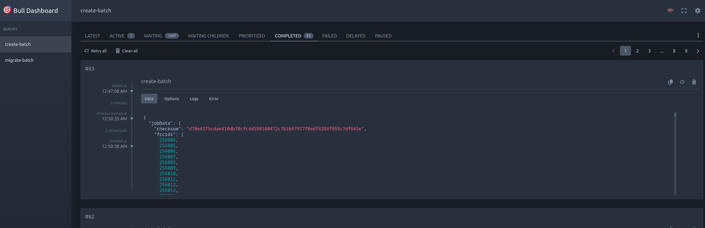

# Ham Radio Prep Challenge - Monorepo

This repository contains both frontend and backend code for the Ham Radio Prep Challenge application.

## Prerequisites

Before getting started, ensure you have the following tools installed:

### NVM (Node Version Manager)
```bash
curl -o- https://raw.githubusercontent.com/nvm-sh/nvm/v0.39.0/install.sh | bash
```

### Git
```bash
# Ubuntu/Debian
sudo apt-get update
sudo apt-get install git

# macOS
brew install git
```

### Docker & Docker Compose
```bash
# Ubuntu/Debian
sudo apt-get update
sudo apt-get install docker.io docker-compose

# macOS
brew install docker docker-compose
```

### DBMate
```bash
# Ubuntu/Debian
sudo curl -fsSL -o /usr/local/bin/dbmate https://github.com/amacneil/dbmate/releases/latest/download/dbmate-linux-amd64
sudo chmod +x /usr/local/bin/dbmate

# macOS
brew install dbmate
```

## Setup Instructions

1. Clone the repository
```bash
git clone https://github.com/your-username/hamradio-prep-challenge.git
cd hamradio-prep-challenge
```

2. Set up Frontend
```bash
cd frontend
nvm use 18
npm install
```

3. Set up Backend
```bash
cd ../backend
nvm use 18
npm install -g pnpm
pnpm install
```

4. Environment Setup
Copy the `.env.example` file in the backend directory and rename it to `.env`.

Then add your google firestore credentials to the `.bashrc` file or `.zshrc` file:

```bash
export firebase_api_key="<API_KEY>"
export firebase_auth_domain="<AUTH_DOMAIN>"
export firebase_project_id="<PROJECT_ID>"
export firebase_storage_bucket="<STORAGE_BUCKET>"
export firebase_message_sender_id="<MESSAGE_SENDER_ID>"
export firebase_app_id="<APP_ID>"
export firebase_measurement_id="<MEASUREMENT_ID>"
```

Then run the following command to update the environment variables:
```
source ~/.bashrc

# or

source ~/.zshrc
```


5. Start Docker Services
From the root directory:
```bash
docker-compose up -d
```

6. Run Database Migrations
```bash
# Replace <backend_container> with actual container name
docker exec -it <backend_container> pnpm run migration:up
```

7. Seed FCC Database
```bash
chmod +x ./backend/hamdb
hamdb full

```

8. Call new seed endpoint if you want to seed the database
```
curl -X POST http://localhost/api/seed
```

9. Check jobs progress and re-run failed jobs go to your browser and navigate to: `http://localhost/api/queues` 


## Development

Frontend development server runs on port 3000 by default:
```bash
cd frontend
npm run dev
```

Backend development server runs on port 80 by default:
```bash
cd backend
pnpm run dev
```

## Additional Information

- Frontend runs on: http://localhost:3000
- Backend API runs on: http://localhost
- Database on port 3306
- Make sure all ports specified in docker-compose.yml are available before running the services

## Troubleshooting

If you encounter any issues:

1. Ensure all required ports are free
2. Check Docker logs: `docker-compose logs`
3. Verify environment variables are properly set
4. Ensure database connection is established
5. Check container status: `docker ps`
6. Run `pnpm install` on backend and `npm install` on frontend with node version 18 and restart the container since its a dev container

For additional help, contact the development team.

```